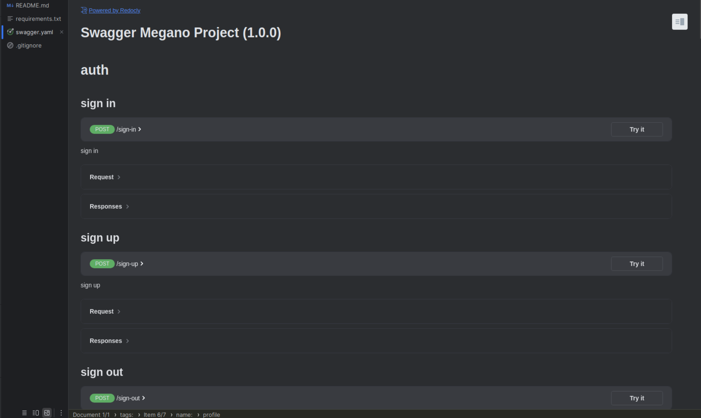

# Общая часть

## Что из себя представляет проект
Предcтавляет собой подключаемое django-приложение. Берет на себя все что связано с отобоажением страниц, а обращение 
за данными происходит по API.

## Контракт для API
Названия роутов и ожидаемую структуру ответа от API endpoints можно найти в `megano/swagger/swagger.yaml`. 
Для более удобного просмотра swagger-описания рекомендуется использовать возможности PyCharm:

## Подключение пакета
1. Установить зависимости `pip install -r requirements.txt`, если появляется ошибка о ненайденном пакете, то в файле `requirements.txt` удалите 2 строку, ведь дальше мы ее все равно установим.
2. Перейти в папку dist `cd dist`
3. Установить пакет в виртуальное окружение: `pip install dop-frontend-X.Y.tar.gz`. X и Y - числа, они могут изменяться в зависимости от текущей версии пакета.
4. Замарозьте зависимости `pip freeze > requirements.txt`
5. В папке `/mysite/mysite` переименовать файл `.env.template` в `.env`
6. Сгенерировать ключ командой `openssl rand -hex 32` и вставить его в файл `.env` в поле `DJANGO_SECRET_KEY`
7. В файле `.env` в поле `DJANGO_DEBUG` ввести значение. `0` если запускать без DEBUG режима и `1` если запускать в DEBUG режиме
8. Перейти в папку mysite `cd mysite`
9. Выполните миграции командой `python manage.py migrate`
10. Далее выполните команды последовательно, чтобы не возникло конфликтов
11. `python manage.py loaddata auth/fixtures/users.json`
12. `python manage.py loaddata products`
13. `python manage.py loaddata basket`
14. `python manage.py loaddata myauth`

Если запустить сервер разработки: `python manage.py runserver`, то по адресу `127.0.0.1:8000` должна открыться стартовая страница интернет-магазина:

## Дополнительная информация

На данный момент сайт заполнен небольшим количеством товаров, заказов, акций и пользователей.
Для удобства создан супер пользоавтель `admin` с паролем `123123`
Ниже представлены созданные пользватели в формате `login` - `password`
1. `Nikita` - `123456`
2. `Bob` - `123456`
3. `Jhon` - `123456`

